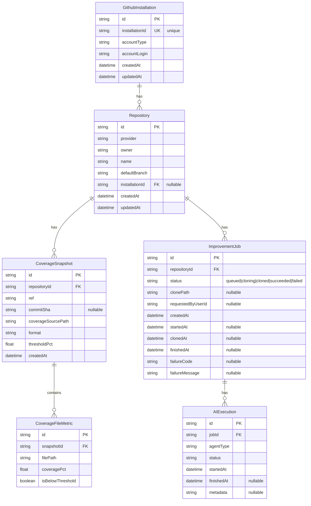
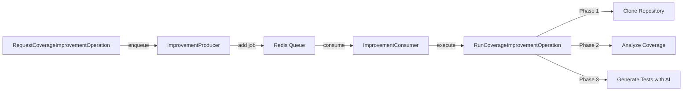
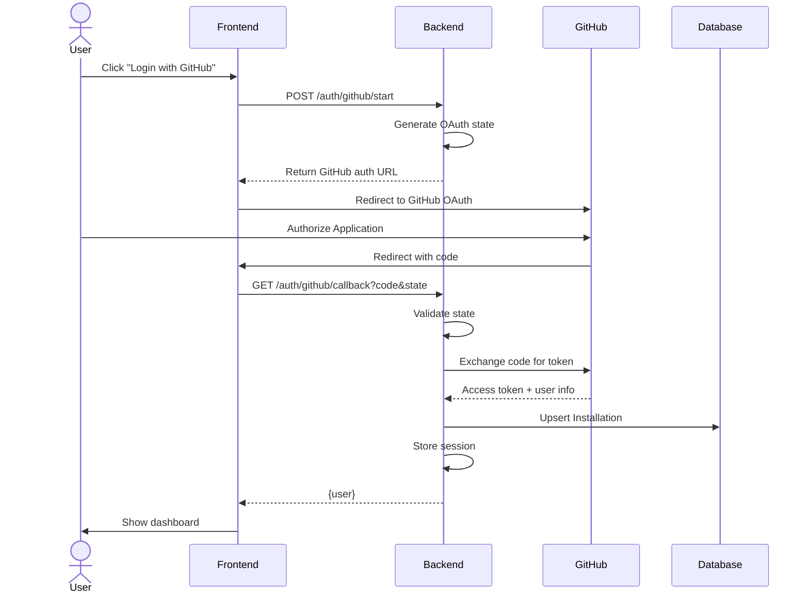
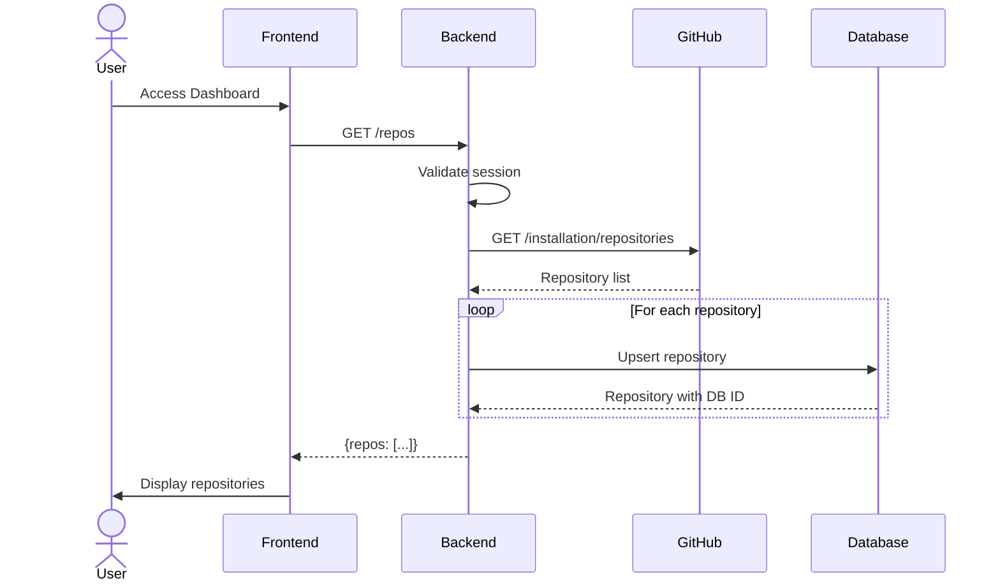
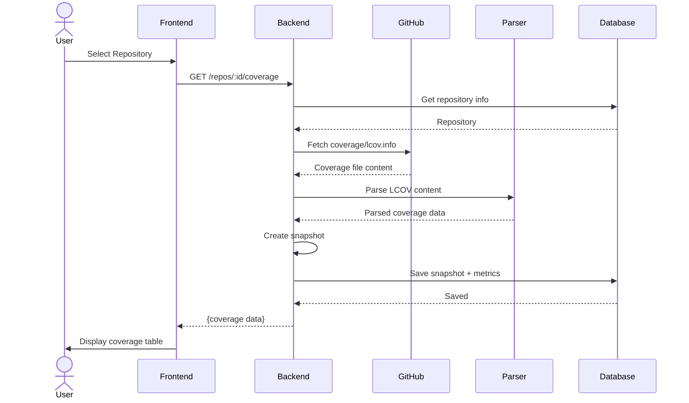
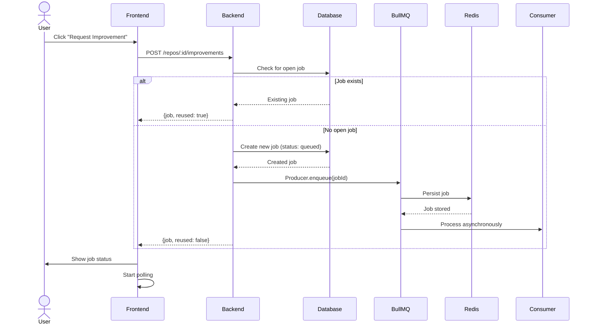
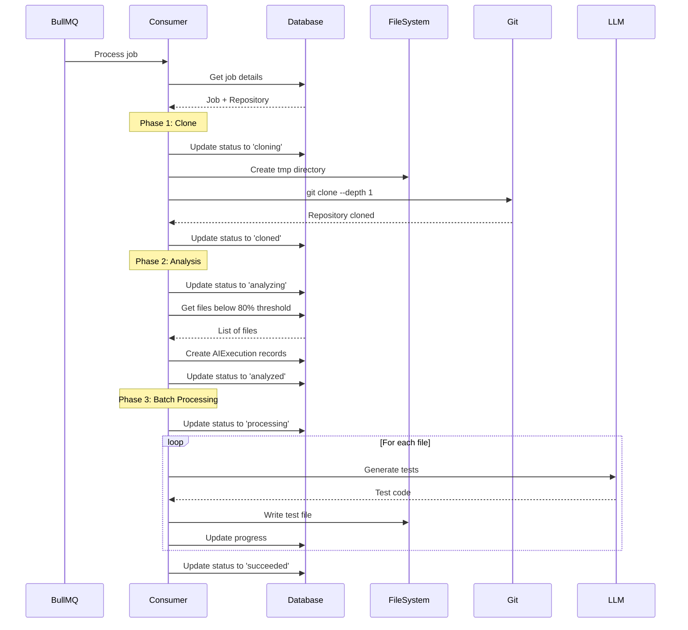
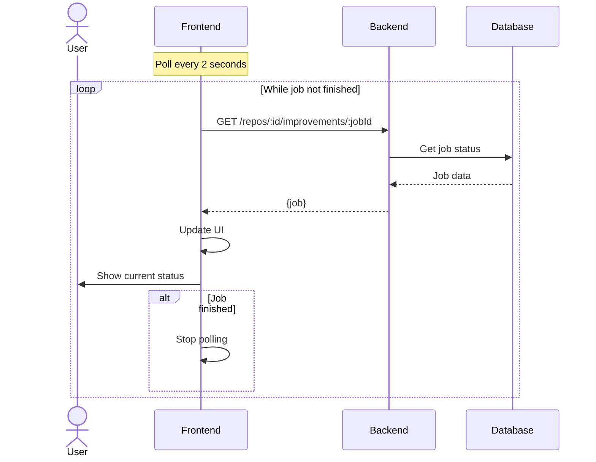

# 🤖 AI Coverage Improver

> Developer tool that analyzes TypeScript test coverage, highlights files below threshold, and lets you request AI-generated tests via pull requests.

[](https://nodejs.org/)
[](https://www.typescriptlang.org/)
[](https://nestjs.com/)
[](https://nextjs.org/)

## 📖 Table of Contents

- [Overview](#overview)
- [Features](#features)
- [Architecture](#architecture)
  - [Database Schema](#database-schema)
  - [Sequence Diagrams](#sequence-diagrams)
- [Getting Started](#getting-started)
- [Project Structure](#project-structure)
- [Documentation](#documentation)
- [Tech Stack](#tech-stack)

## 🎯 Overview

AI Coverage Improver is a monorepo project that integrates with GitHub to:

1. **Analyze** test coverage from committed reports on the default branch
2. **Highlight** files below the coverage threshold (80%)
3. **Generate** AI-powered test files through automated pull requests
4. **Track** improvement jobs with real-time status updates

The project follows Domain-Driven Design (DDD) with an Operations Pattern, ensuring clean separation of concerns and maintainable code.

## ✨ Features

- 🔐 **GitHub OAuth Authentication** - Secure login with GitHub App integration
- 📊 **Coverage Analysis** - Parse and display coverage reports (LCOV format)
- 🎯 **Smart Filtering** - Automatically identify files below threshold
- 🤖 **AI Test Generation** - Request automated test creation (Phase 1: Clone ready)
- 📈 **Real-time Updates** - Live job status with automatic polling
- 🔄 **Job Queue with BullMQ** - Redis-backed job queue with retry, concurrency control, and rate limiting
- 💾 **Persistent Storage** - SQLite database with Prisma ORM

## 🏗️ Architecture

### Database Schema



### Job Queue Architecture

The application uses **BullMQ** with **Redis** for production-ready job processing:



**Key Features:**
- **Persistence**: Jobs stored in Redis survive server restarts
- **Retry Logic**: 3 attempts with exponential backoff (5s, 10s, 20s)
- **Concurrency**: Process up to 2 jobs simultaneously
- **Rate Limiting**: Maximum 10 jobs per minute
- **Job Retention**: Completed jobs kept for 24h, failed jobs for 7 days
- **Horizontal Scaling**: Multiple workers can process the same queue

**Components:**
- **ImprovementProducer**: Enqueues jobs to BullMQ
- **ImprovementConsumer**: Processes jobs with automatic retry
- **RunCoverageImprovementOperation**: Executes the 3-phase workflow

### Sequence Diagrams

#### 1. GitHub OAuth Authentication



#### 2. List Repositories



#### 3. Analyze Coverage



#### 4. Request Coverage Improvement



#### 5. Process Improvement Job (BullMQ Consumer)



#### 6. Job Status Polling



## 🚀 Getting Started

### Prerequisites

- **Node.js** 20+ ([Download](https://nodejs.org/))
- **pnpm** (`npm install -g pnpm`)
- **Redis** 6+ (for job queue) - See [installation options](#redis-setup)
- **GitHub App** (for OAuth integration)

### Installation

1. **Clone the repository**

```bash
git clone <repository-url>
cd ai-coverage-improver
```

2. **Install dependencies**

```bash
pnpm install
```

3. **Set up environment variables**

Copy the example file and fill in your values:

```bash
cp .env.example .env
```

Then edit `.env` with your actual values. See [`.env.example`](./.env.example) for detailed documentation of all available options.

**Required variables:**
- `GITHUB_APP_ID`, `GITHUB_CLIENT_ID`, `GITHUB_CLIENT_SECRET` - From your GitHub App
- `GITHUB_TOKEN` - Personal access token with repo permissions
- `SESSION_SECRET` - Random secret (generate with: `openssl rand -hex 32`)
- `LLM_API_KEY` - API key for your LLM provider
- `DATABASE_URL` - Database connection string
- `REDIS_HOST` - Redis host (default: `localhost`, use `redis` for Docker)
- `REDIS_PORT` - Redis port (default: `6379`)
- `REDIS_PASSWORD` - Redis password (optional, leave empty for development)

**Note:** All configuration is now managed through a centralized `ConfigService`. See [`docs/CONFIG_MIGRATION.md`](./docs/CONFIG_MIGRATION.md) for details.

4. **Run database migrations**

```bash
pnpm db:migrate
```

5. **Generate Prisma Client**

```bash
pnpm db:generate
```

### Redis Setup

The application requires Redis for the job queue (BullMQ). Choose one option:

**Option 1: Docker (Recommended)**

```bash
docker-compose up -d redis
```

Verify it's running:
```bash
docker-compose ps redis
docker-compose logs redis
```

**Option 2: Local Installation**

macOS:
```bash
brew install redis
brew services start redis
```

Ubuntu/Debian:
```bash
sudo apt-get install redis-server
sudo systemctl start redis
sudo systemctl enable redis
```

**Test connection:**
```bash
redis-cli ping  # Should output: PONG
```

### Running the Application

**Development mode:**

```bash
# Using pnpm
pnpm dev:backend  # Terminal 1
pnpm dev:web      # Terminal 2

# Or using Make
make dev
```

**Production mode:**

```bash
# Build and run locally
pnpm build
pnpm start:backend & pnpm start:web

# Or using Docker
make docker-build
make docker-up
```

**Access the application:**
- Frontend: http://localhost:3001
- Backend API: http://localhost:3000
- API Health: http://localhost:3000/health

### Docker Deployment

The project includes production-ready Docker support:

```bash
# Quick start
make docker-build   # Build images
make docker-up      # Start services
make docker-logs    # View logs

# Or use docker-compose directly
docker-compose build
docker-compose up -d
```

See [Docker Deployment Guide](./docs/DOCKER_DEPLOYMENT.md) for detailed instructions.

**Services:**
- Backend (NestJS) with graceful shutdown
- Frontend (Next.js)
- SQLite database (with Docker volume)
- Redis (for BullMQ job queue)

## 📁 Project Structure

```
ai-coverage-improver/
├── apps/
│   ├── backend/                 # NestJS Backend
│   │   ├── prisma/
│   │   │   ├── schema.prisma   # Database schema
│   │   │   └── migrations/     # Database migrations
│   │   ├── src/
│   │   │   ├── api/            # HTTP Controllers
│   │   │   ├── application/    # Operations (Use Cases)
│   │   │   ├── domain/         # Domain Entities
│   │   │   ├── infrastructure/ # External services
│   │   │   ├── workers/        # Background jobs
│   │   │   └── main.ts         # Entry point
│   │   └── test/               # Integration tests
│   └── web/                     # Next.js Frontend
│       └── src/
│           ├── components/     # React components
│           ├── contexts/       # React contexts
│           ├── lib/           # API client
│           └── pages/         # Next.js pages
├── packages/
│   ├── coverage/              # Coverage parser
│   └── github/                # GitHub utilities
├── specs/                      # Project specifications
├── ARCHITECTURE.md            # Architecture documentation
└── README.md                  # This file
```

## 📚 Documentation

- **[Architecture Guide](./ARCHITECTURE.md)** - Complete guide to DDD + Operations Pattern
- **[Docker Deployment](./docs/DOCKER_DEPLOYMENT.md)** - Production deployment with Docker
- **[Deployment Summary](./docs/DEPLOYMENT_SUMMARY.md)** - Implementation summary (tasks #4 and #5)
- **[Specs](./specs/001-coverage-pr-bot/)** - Detailed project specifications
- **[API Contracts](./specs/001-coverage-pr-bot/contracts/openapi.yaml)** - OpenAPI specification

## 🛠️ Tech Stack

### Backend
- **[NestJS](https://nestjs.com/)** - Progressive Node.js framework
- **[Prisma](https://www.prisma.io/)** - Next-generation ORM
- **[SQLite](https://www.sqlite.org/)** - Embedded database (PostgreSQL ready)
- **[BullMQ](https://bullmq.io/)** - Redis-based job queue with advanced features
- **[Redis](https://redis.io/)** - In-memory data store for job queue
- **[TypeScript](https://www.typescriptlang.org/)** - Type safety

### Frontend
- **[Next.js](https://nextjs.org/)** - React framework
- **[React](https://react.dev/)** - UI library
- **[TypeScript](https://www.typescriptlang.org/)** - Type safety

### DevOps & Tools
- **[pnpm](https://pnpm.io/)** - Fast, disk space efficient package manager
- **[Jest](https://jestjs.io/)** - Testing framework
- **[ESLint](https://eslint.org/)** - Code linting
- **[Prettier](https://prettier.io/)** - Code formatting

## 📝 Available Scripts

### Development

| Script | Description |
|--------|-------------|
| `pnpm install` | Install all dependencies |
| `pnpm dev:backend` | Start backend dev server |
| `pnpm dev:web` | Start frontend dev server |
| `pnpm build` | Build for production |
| `pnpm test` | Run all tests |
| `pnpm lint` | Run linter |
| `pnpm format` | Format code with Prettier |

### Database

| Script | Description |
|--------|-------------|
| `pnpm db:generate` | Generate Prisma Client |
| `pnpm db:migrate` | Run database migrations |
| `pnpm db:studio` | Open Prisma Studio |

### Docker

| Script | Description |
|--------|-------------|
| `make docker-build` | Build Docker images |
| `make docker-up` | Start all services |
| `make docker-down` | Stop all services |
| `make docker-logs` | View logs |
| `make docker-clean` | Remove all containers and volumes |

Run `make help` to see all available commands.

## 🎯 Current Status

### ✅ Completed Features
- GitHub OAuth authentication flow
- Repository listing and synchronization
- Coverage analysis and parsing (LCOV format)
- Coverage visualization with threshold highlighting
- Job creation and management with BullMQ
- Redis-backed job queue with retry and rate limiting
- Repository cloning (Phase 1)
- Coverage analysis to identify files below 80% (Phase 2)
- AI-powered test generation in batch (Phase 3)
- Real-time job status updates with polling
- Session management
- Database schema and migrations

### 🚧 In Progress
- Pull request creation with generated tests
- Enhanced error handling and retry logic

### 📋 Planned Features
- Support for multiple coverage formats
- Configurable coverage thresholds
- Job history and analytics
- Webhook integration
- Bull Board UI for queue monitoring

## 🤝 Contributing

Contributions are welcome! Please read the [Architecture Guide](./ARCHITECTURE.md) to understand the project structure and patterns.

## 📄 License

This project is licensed under the MIT License.

## 🔒 Safety Rules

The system enforces strict safety rules:
1. ✅ Only operates on the default branch
2. ✅ Only creates/modifies `*.test.ts` files
3. ✅ Never executes tests automatically
4. ✅ Never auto-merges pull requests
5. ✅ Runs in isolated execution environment

---

**Made with ❤️ using TypeScript, NestJS, and Next.js**
